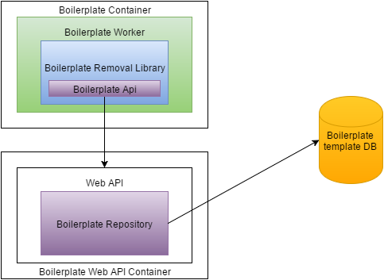
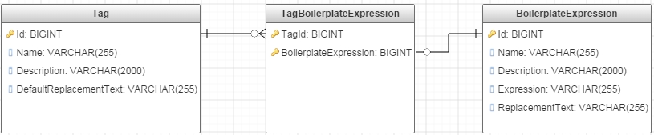

# Boilerplate Removal Worker

This worker is used to remove boilerplate text from the passed in text.

### General Overview
It will be possible to define boilerplate expressions which will be used to identify boiler plate text and to specify the treatment as either remove or replace.
For ease of policy configuration, boilerplate expressions can optionally be grouped together using a Tag.  
This is depicted below in figure 2.

There will be two containers created one will be the Boilerplate Worker and the other will be the Boilerplate API.
The Boilerplate API will allow users to create, retrieve, update and delete boilerplate expressions and tags. 
The Boilerplate Worker will be given the text along with the boilerplate expressions to look for, it will then return any boilerplate text it finds. The caller can specify that boilerplate text should be removed/replaced. When replacing the replacement text on the expression has preference over the default replacement text on the tags.

*Figure 1*

## Boilerplate API
The API will have CRUD methods for two objects, boilerplate expression and a tag. 
The boilerplate expression will consist of a name, description, expression, replacement text and a list of tags. The tags will have a name, description and default replacement text.

A boilerplate expression can have many tags and it can be used in within multiple different tags.

All calls will take in a tennantId which uniquely identifies the tennant.

The 'Tag' will be 

<table>
    <tr>
        <td><b>Name</b></td>
        <td><b>Type</b></td>
        <td><b>Description</b></td>
    </tr>
    <tr>
    	<td>id</td>
    	<td>long</td>
    	<td>The id of the tag</td>
    </tr>
    <tr>
    	<td>name </td>
    	<td>String</td>
    	<td>The name of the tag</td>
    </tr>
    <tr>
        <td>description</td>
        <td>String</td>
        <td>The description of the tag</td>
    </tr>
    <tr>
        <td>defaultReplacementText</td>
        <td>String</td>
        <td>The default replacement text for this tag</td>
    </tr>
    <tr>
    	<td>boilerplateExpressions</td>
    	<td>long[]</td>
    	<td>The ids of the attached BoilerplateExpressions.</td>
    </tr>
</table>

and the 'BoilerplateExpression' will be of the form

<table>
    <tr>
        <td><b>Name</b></td>
        <td><b>Type</b></td>
        <td><b>Description</b></td>
    </tr>
    <tr>
    	<td>id </td>
    	<td>long</td>
    	<td>The id of the boilerplate expression.</td>
    </tr>
    <tr>
        <td>name</td>
        <td>String</td>
        <td>The name of the boilerplate expression.</td>
    </tr>
    <tr>
        <td>description</td>
        <td>String</td>
        <td>The description for the boilerplate expression.</td>
    </tr>
    <tr>
    	<td>replacementText</td>
    	<td>String <i>optional</i></td>
    	<td>The string to replace the text with. Default value is &lt;boilerplate content&gt; Needed for Phase 2.</td>
    </tr>
    <tr>
    	<td>expression</td>
    	<td>String</td>
    	<td>The regular expression which identifies the boilerplate text.</td>
    </tr>
</table>

#### Retrieving

Retrieving will be a GET request against the following url

<table>
<tr>
    <td><b>Object</b></td>
    <td><b>Url</b></td>
    <td><b>Description</b></td>
</tr>
<tr>
    <td>tag</td>
    <td>/tag/<i>{id}</i></td>
    <td>Returns the tag with the matching <i>id</i>.</td>
</tr>
<tr>
    <td>tag[]</td>
    <td>/tags</td>
    <td>Returns all the tags.</td>
</tr>
<tr>
    <td>tag[]</td>
    <td>/tags?page=<i>{pageNumber}</i>&size=<i>{pageSize}<i/></td>
    <td>Returns a page of tags. If <i>pageNumber</i> is set <i>pageSize</i> defaults to 20.</td>
</tr>
<tr>
    <td>expression</td>
    <td>/expression/<i>{id}</i></td>
    <td>Returns the expression with the matching <i>id</i>.</td>
</tr>
<tr>
    <td>expression[]</td>
    <td>/expressions?page=<i>{pageNumber}</i>&size=<i>{pageSize}<i/></td>
    <td>Returns a page of expressions. <i>pageNumber</i> default to 1 and <i>pageSize</i> defaults to 20.</td>
</tr>

<tr>
    <td>tag[] </td>
    <td>/expression/<i>{id}</i>/tags</td>
    <td>Returns the tags for an expression <i>id</i>.</td>
</tr>
<tr>
    <td>expression[] </td>
    <td>/tag/<i>{id}</i>/expressions</td>
    <td>Returns the expressions for a tag <i>id</i>.</td>
</tr>
<tr>
    <td>expression[]</td>
    <td>/tag/<i>{id}</i>/expressions?page=<i>{pageNumber}</i>&size=<i>{pageSize}<i/></td>
    <td>Returns a page of expressions for a tag <i>id</i>. If <i>pageNumber</i> is set <i>pageSize</i> defaults to 20.</td>
</tr>
</table>

##### Response codes
<table>
    <tr>
        <td><b>Code</b></td>
        <td><b>Description</b></td>
    </tr>
    <tr>
    	<td>200</td>
    	<td>Success. The body with contain the requested items.</td>
    </tr>
    <tr>
    	<td>404</td>
    	<td>The item could not be found.</td>
    </tr>
    <tr>
    	<td>500</td>
    	<td>Internal Server error.</td>
    </tr>
</table>

#### Create
To create call the following methods with a POST request where the body is the detail for the object
<table>
    <tr>
        <td><b>Object</b></td>
        <td><b>Url</b></td>
        <td><b>Description</b></td>
    </tr>
    <tr>
    	<td>tag</td>
    	<td>/tag</td>
    	<td>Creates the tag and returns the tag with its new id.</td>
    </tr>
    <tr>
        <td>expression</td>
        <td>/expression</td>
        <td>Creates an expression and returns it along with its new id.</td>
    </tr>
</table>

##### Response codes
<table>
    <tr>
        <td><b>Code</b></td>
        <td><b>Description</b></td>
    </tr>
    <tr>
    	<td>201</td>
    	<td>Created. Body will return the created item and the location header will contain a link to the item.</td>
    </tr>
    <tr>
    	<td>404</td>
    	<td>The item could not be found.</td>
    </tr>
    <tr>
    	<td>500</td>
    	<td>Internal Server error.</td>
    </tr>
</table>

#### Update
To update an object call the PUT method where the object detail is in the request body.
<table>
    <tr>
        <td><b>Object</b></td>
        <td><b>Url</b></td>
        <td><b>Description</b></td>
    </tr>
    <tr>
    	<td>tag</td>
    	<td>/tag/<i>{id}</i></td>
    	<td>Updates the tag with the given <i>id</i> and returns the updated tag.</td>
    </tr>
    <tr>
    	<td>expression </td>
    	<td>/expression/<i>{id}<i></td>
    	<td>Updates the expression with the given <i>id</i> and returns the updated expression.</td>
    </tr>
</table>

##### Response codes
<table>
    <tr>
        <td><b>Code</b></td>
        <td><b>Description</b></td>
    </tr>
    <tr>
    	<td>200</td>
    	<td>Success. The body with contain the updated items.</td>
    </tr>
    <tr>
    	<td>404</td>
    	<td>The item could not be found.</td>
    </tr>
    <tr>
    	<td>500</td>
    	<td>Internal Server error.</td>
    </tr>
</table>

#### Delete
To delete make a DELETE request to the following url
<table>
    <tr>
    	<td>tag</td>
    	<td>/tag/<i>{id}</i></td>
    	<td>Deletes the tag with the matching <i>id</i>.</td>
    </tr>
    <tr>
    	<td>expression</td>
    	<td>/expression/<i>{id}</i></td>
    	<td>Deletes the expression with the matching <i>id</i>.</td>
    </tr>
</table>

##### Response codes
<table>
    <tr>
        <td><b>Code</b></td>
        <td><b>Description</b></td>
    </tr>
    <tr>
    	<td>200</td>
    	<td>Success.</td>
    </tr>
    <tr>
    	<td>404</td>
    	<td>The item could not be found.</td>
    </tr>
    <tr>
    	<td>500</td>
    	<td>Internal Server error.</td>
    </tr>
</table>

We will send back eTags and support if-match so that two users updating the same object dont conflict with each other. We will also support an override (not specifying the if-match header).
#### Database Diagram

*Figure 2*

## Boilerplate Worker

##### Request

<table>
    <tr>
    	<td><b>Name</b></td>
        <td><b>Type</b></td>
        <td><b>Description</b></td>
    </tr>
    <tr>
    	<td>tennantId</td>
    	<td>String</td>
    	<td>Used to identify the tennant making the request.</td>
    </tr>
    <tr>
        <td>expressions</td>
        <td>SelectedItems</td>
        <td>The expressions to evaluate the fields against.</td>
    </tr>
    <tr>
    	<td>sourceData</td>
    	<td>Multimap&lt;String, ReferenceData&gt;</td>
    	<td>A map of field names to field values which will be evaluated for boilerplate text.</td>
    </tr>
    <tr>
    	<td>redactionType</td>
    	<td>enum{DoNothing,Remove,Replace}</td>
    	<td><b>Default: DoNothing</b>. Indicates if the field values should be updated to remove matches.</td>
    </tr>
    <tr>
        <td>dataStorePartialReference</td>
        <td>String</td>
        <td>The location in the datastore where we will store newly generated data.</td>
    </tr>
	<tr>
		<td>returnMatches</td>
		<td>boolean</td>
		<td><b>Default: true</b>. Indicates whether details of boilerplate expression matches should be returned.</td>
	</tr>
</table>

Where the `SelectedTag` class extends `SelectedItems`
<table>
    <tr>
        <td><b>Name</b></td>
        <td><b>Type</b></td>
        <td><b>Description</b></td>
    </tr>
    <tr>
        <td>tagId</td>
        <td>long</td>
        <td>The Id of the Boilerplate Tag to use.</td>
    </tr>
</table>

Where the `SelectedExpressions` class extends `SelectedItems`
<table>
    <tr>
        <td><b>Name</b></td>
        <td><b>Type</b></td>
        <td><b>Description</b></td>
    </tr>
    <tr>
        <td>expressionIds</td>
        <td>long[]</td>
        <td>A list of boilerplate expression Ids to use.</td>
    </tr>
</table>

Where the `SelectedEmail` class extends `SelectedItems`
<table>
    <tr>
        <td><b>Name</b></td>
        <td><b>Type</b></td>
        <td><b>Description</b></td>
    </tr>
    <tr>
        <td>primaryContent</td>
        <td>String</td>
        <td>An expression that defines the primary content of an email.</td>
    </tr>
    <tr>
        <td>secondaryContent</td>
        <td>String</td>
        <td>An expression that defines the secondary content of an email.</td>
    </tr>
    <tr>
        <td>tertiaryContent</td>
        <td>String</td>
        <td>An expression that defines the tertiary content of an email.</td>
    </tr>
</table>

##### Response

The result is 
<table>
    <tr>
        <td><b>Name</b></td>
        <td><b>Type</b></td>
        <td><b>Description</b></td>
    </tr>
    <tr>
        <td>taskResults</td>
        <td>Map&lt;String, BoilerplateResult&gt;</td>
        <td>The results for a field.</td>
    </tr>
</table>

The `BoilerplateResult` is of the form
<table>
    <tr>
        <td><b>Name</b></td>
        <td><b>Type</b></td>
        <td><b>Description</b></td>
    </tr>
    <tr>
        <td>data</td>
        <td>Collection&lt;ReferencedData&gt;</td>
        <td>The modified ReferenceData.</td>
    </tr>
    <tr>
        <td>matches</td>
        <td>Collection&lt;BoilerplateMatch&gt;</td>
        <td>The boilerplate match information for the field name.</td>
    </tr>
    <tr>
        <td>groupedMatches</td>
        <td>Multimap&lt;String,ReferencedData%gt;</td>
        <td>A multimap of ReferencedData. Currently used to hold the Primary, Secondary and Tertiary content from email segregation.</td>
    </tr>
</table>

The `BoilerplateMatch` is of the form
<table>
    <tr>
        <td><b>Name</b></td>
        <td><b>Type</b></td>
        <td><b>Description</b></td>
    </tr>
    <tr>
        <td>boilerplateId</td>
        <td>Long</td>
        <td>The id of the boilerplate expression.</td>
    </tr>
    <tr>
        <td>value</td>
        <td>String</td>
        <td>The text which was found.</td>
    </tr>
</table>

### SelectedEmail Expressions

The expressions used by SelectedEmail specify a range of messages for each content level.

Emails a separated into a numbered list of 0 (The latest reply) up-to LAST (The original message). 

For example, an email with 3 replies would be separated out like this.

<table>
    <tr>
        <td>0</td>
        <td>Latest reply</td>
    </tr>
    <tr>
        <td>1</td>
        <td> First quoted reply</td>
    </tr>
    <tr>
        <td>2</td>
        <td>Second quoted reply</td>
    </tr>
    <tr>
        <td>LAST</td>
        <td>The original Message</td>
    </tr>
</table>

The following syntax for the expressions is valid: 

*   Just an index: "0"
*   A range: "1..2"
*   A range and substitution: "1..LAST-3"